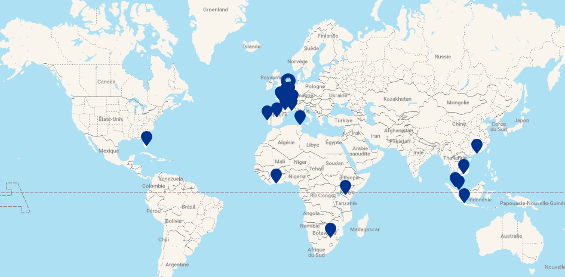

## Présentation

Présentation de l'entreprise Henner
Le Groupe Henner est une entreprise française spécialisée dans la gestion et le courtage d’assurances de personnes. Fondé en 1964, le groupe s’est progressivement développé à l’international, avec une implantation en Asie depuis 1999 à Singapour, en Afrique depuis 2007 au Kenya, et aux USA depuis 2011.

Aujourd’hui, Henner compte plus de 20 sites dans le monde et gère les contrats de plus de 2,3 millions de bénéficiaires. Ce positionnement mondial fait d’elle un acteur majeur dans son domaine.

## Secteur et service d'accueil

Durant mon stage, j’ai intégré le service DSI (Direction des Systèmes d’Information), répartie entre les sites de Nantes et Neuilly-sur-Seine.

Plus précisément, j’ai été accueilli au sein de l'équipe HDS (Henner Delivery & Support), dans le secteur Dev – IT-Dev. Ce service est chargé de la mise en place de nouvelles implémentations.

L’environnement de travail était un open-space accueillant une trentaine de collaborateurs, favorisant les échanges entre les membres des différentes équipes techniques.

